<h1 align="center">Hi 👋, I'm Devansh Garg</h1>
<h3 align="center">Software Engineer | Backend • AI/ML • Agentic AI • DevOps • Distributed Systems</h3>

  <!-- ANIMATED BADGES -->
  

  
  
  
  

---

# ⭐ **About Me**

- 🎓 3rd year B.Tech CSE Student at **VIT Bhopal**  
- 👨‍💻 Passionate about **Backend Engineering, AI/ML, Agentic AI, Distributed Systems, DevOps, Cloud**  
- 🚀 I love building **production-grade systems**, scalable APIs, ML pipelines, and AI-driven platforms  
- 🔥 Experience in **SpringBoot, FastAPI, Kafka, Redis, CI/CD, Microservices, LangGraph Agents**  
- 💡 Currently exploring **High-Performance Backend + Autonomous AI Systems**  
- 🎯 Career Goal: **Backend Engineer / AI Engineer at a high-scale product company**

---

# 🛠️ **Tech Stack**

### 🔧 **Backend**
FastAPI | Spring Boot | Django | Redis | Kafka | RabbitMQ | WebSockets | Microservices | System Design

### 🤖 **AI / ML**
PyTorch | CNN | LSTM | Transformers | Autoencoders | Computer Vision | YOLOv8 | Gait Analysis | RAG | LangGraph | Agentic AI

### ☁️ **DevOps / Cloud**
Docker | Kubernetes | GitHub Actions | Jenkins | AWS (EC2, S3) | Linux | Terraform

### 🎨 **Frontend**
Next.js | React | TailwindCSS

### 🗄️ **Databases**
PostgreSQL | MySQL | MongoDB | Redis

### 💻 **Languages**
Python | Java | C++ | JavaScript | TypeScript | Go

<h3 align="left">Languages and Tools:</h3>

                                        

---

# 🧠 **Developer Mindmap (Mermaid Diagram)**  
> This diagram shows my skills, strengths, projects, achievements, and career direction.

```mermaid
mindmap
  root(("🚀 Devansh Garg"))
    Identity
      "👨‍💻 Software Engineer"
      "🤖 AI/ML & Agentic AI Specialist"
      "🧩 Backend & Distributed Systems Engineer"
      "🌐 Full-Stack Developer Next.js"
      "☁️ DevOps & Cloud Engineer"
      "🎯 System Design Enthusiast"
    Backend Engineering
      Frameworks
        FastAPI
        Spring Boot
        Node.js
      Architecture
        "Microservices"
        "Event-Driven Systems"
        "Scalable REST APIs"
        "Asynchronous Workers"
      Messaging
        Kafka
        RabbitMQ
      Core Strengths
        "Low Latency APIs"
        "Redis Caching"
        "DB Optimization"
        "System Reliability"
    AI & Machine Learning
      Deep Learning
        CNNs
        LSTMs
        Transformers
        Autoencoders
      Agentic AI
        LangGraph
        Multi-Agent Systems
      Computer Vision
        YOLOv8
        DeepFace
        Gait Analysis
      NLP
        RAG Systems
    DevOps & Cloud
      Docker
      Kubernetes
      AWS
      GitHub Actions
      Jenkins
      Terraform
    Full Stack Development
      Next.js
      React
      TailwindCSS
    Databases
      PostgreSQL
      MongoDB
      MySQL
      Redis
    Major Projects
      "🔧 Agentic AI Predictive Maintenance System"
      "🕵️ Missing Person Detection Face + Gait + Blockchain"
      "☁️ Autonomous CSPM System"
      "🧪 ChemViz Industrial Simulator"
      "💰 Fintech Anomaly Detection & Privacy Platform"
    Experience
      "Backend Intern — FastAPI Microservices"
      "CI/CD, Redis Caching, Async Workers"
    Achievements
      "🏆 5th place — Suraksha Cyber Hackathon"
      "🎯 Flipkart Grid 6.0 & 7.0 Qualified"
      "📘 NPTEL ML Top 5%"
      "🚀 Freelance Production Deployments"

```

# **🚀 Top Projects**
## **🔧 Agentic AI Predictive Maintenance System**

- LSTM-AE anomaly detection + LightGBM failure prediction

- Kafka streaming, digital-twin embeddings, LangGraph agents

# **🕵️ Missing Person Detection (Face + Gait + Blockchain)**

- YOLOv8 + DeepFace

- Gait recognition + Blockchain evidence hashing

- Agentic workflow for CCTV scanning

# **☁️ Autonomous Cloud Security Posture Management (CSPM)**

- Misconfig detection via graph modeling

- Kafka pipelines + auto-remediation

# **🧪 ChemViz – Chemical Equipment Parameter Visualizer**

- Engineering formula engine + safety simulation

#  **💰 Fintech Anomaly Detection & Privacy Engine**

- AI-based risk scoring

- Blockchain-backed consent tracking

- Privacy-first architecture

# **📊 GitHub Stats**

   
 
  

# Experience
      "Backend Intern — FastAPI Microservices"
        "FastAPI microservices"
        "Async workers"
        "Redis caching"
        "CI/CD pipelines"
        "Containerized deployments"
        "Production-ready API design"
# Achievements
      "🏆 5th place — Suraksha Cyber Hackathon"
      "🎯 Flipkart Grid 6.0 & 7.0 DSA Rounds Cleared"
      "🚀 Freelance production deployments"
      "📘 NPTEL ML Top 5%"
      "🧠 Built 5+ large-scale AI/Backend systems"

# Career Goals
      "Backend Engineer at a high-scale product company"
      "AI/ML Engineering specialization"
      "Distributed systems mastery"
      "Building real-world impactful AI products"

# 📬 Contact Me
## If you want to collaborate, discuss backend/ML systems, or work on exciting engineering ideas:
### 📧 Email — gargdevansh728@gmail.com

### 🔗 LinkedIn — [https://linkedin.com/in/yourID](https://linkedin.com/in/devanshgarg728)
